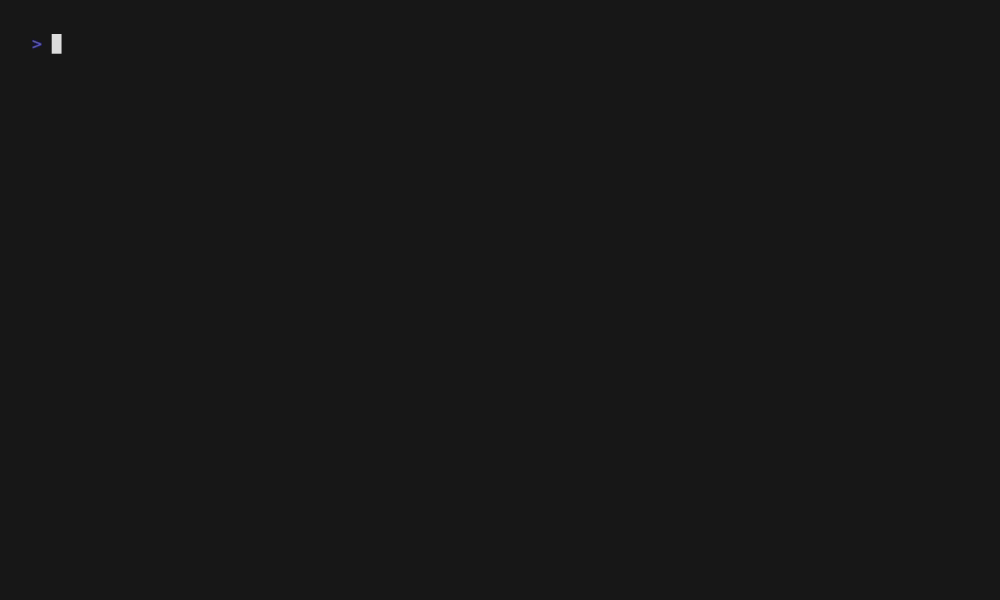

[](https://github.com/bodgit/memcardpro/releases)
[](https://github.com/bodgit/memcardpro/actions?query=workflow%3Abuild)
[](https://coveralls.io/github/bodgit/memcardpro?branch=main)
[](https://goreportcard.com/report/github.com/bodgit/memcardpro)
[](https://godoc.org/github.com/bodgit/memcardpro)


memcardpro
==========

The `memcardpro` utility currently allows you to split a generic memory card image into separate per-game memory cards for use on the [8BitMods MemCard PRO](https://8bitmods.com/accessories/memcard-pro/) with a supported ODE such as [MODE](https://terraonion.com/en/producto/terraonion-mode/) or [XStation](https://8bitmods.com/xstation-optical-drive-emulator-ode-kit/) on the Sony PlayStation 1, or [Swiss](https://github.com/emukidid/swiss-gc) on the Nintendo GameCube.

Installation:
```
go install github.com/bodgit/memcardpro@latest
```
Or grab a pre-built binary from the [releases page](https://github.com/bodgit/memcardpro/releases).

A quick demo:


